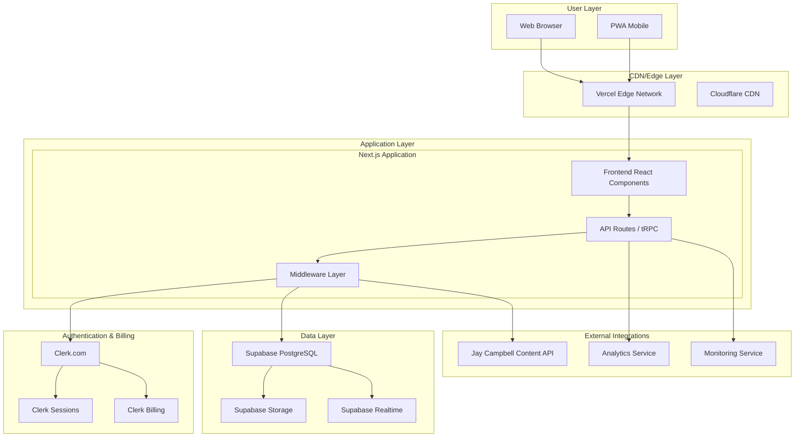
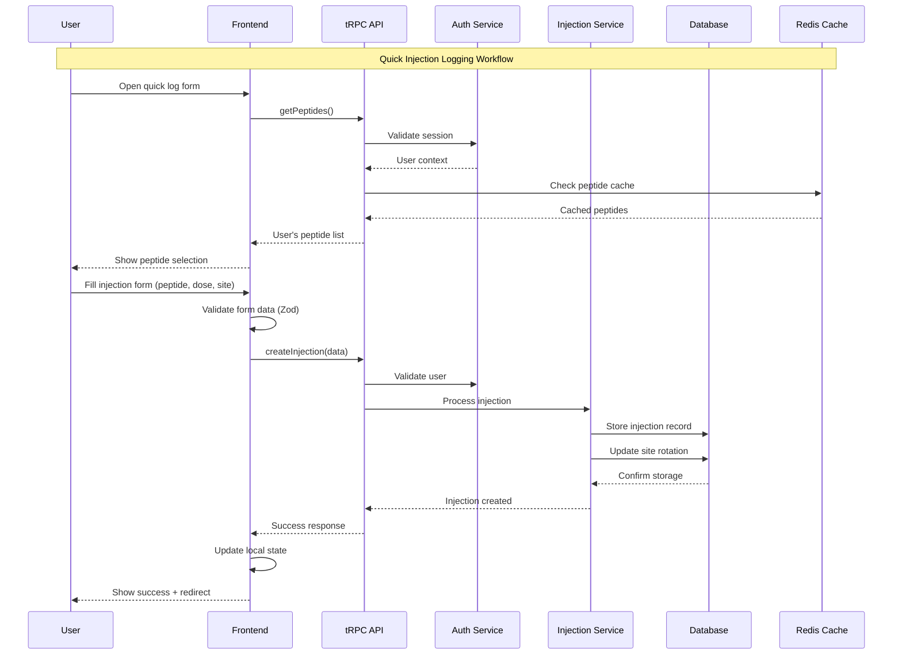

# Peptide Tracker Fullstack Architecture Document

## Introduction

This document outlines the complete fullstack architecture for Peptide Tracker, including backend systems, frontend implementation, and their integration. It serves as the single source of truth for AI-driven development, ensuring consistency across the entire technology stack.

This unified approach combines what would traditionally be separate backend and frontend architecture documents, streamlining the development process for modern fullstack applications where these concerns are increasingly intertwined.

### Starter Template or Existing Project

Based on the PRD analysis, this is a greenfield Next.js project. The PRD specifically mentions:
- **Frontend Framework:** Next.js 14+ with React 18+
- **Database:** Supabase (PostgreSQL)
- **Authentication & Billing:** Clerk.com
- **Hosting:** Vercel deployment
- **UI Framework:** Tailwind CSS

I recommend starting with the **T3 Stack** (Create-T3-App) as it provides an excellent foundation that aligns perfectly with the PRD requirements:
- Next.js 14+ with TypeScript
- Tailwind CSS pre-configured
- tRPC for type-safe APIs
- NextAuth.js (easily replaceable with Clerk)
- Prisma ORM (can be adapted for Supabase)

**Constraint:** The architecture must support the modular tracking system mentioned in the UX spec, allowing users to toggle different health metrics on/off.

### Change Log

| Date | Version | Description | Author |
|------|---------|-------------|---------|
| 2025-09-29 | 1.0 | Initial architecture document created from PRD and UX spec | Claude Code |

## High Level Architecture

### Technical Summary

The Peptide Tracker implements a modern Jamstack architecture using Next.js 14 as a full-stack framework with API routes, deployed on Vercel for optimal performance and global edge distribution. The frontend leverages React 18 with TypeScript for type safety, Tailwind CSS for rapid UI development, and a modular component architecture supporting both specialized peptide tracking and extensible wellness metrics. The backend utilizes Next.js API routes with tRPC for type-safe client-server communication, Supabase PostgreSQL for robust data persistence with real-time capabilities, and Clerk.com for comprehensive authentication and subscription billing. This architecture achieves the PRD's sub-2 second load time requirements while providing the foundation for Jay Campbell's expert content integration and the UX spec's modular tracking system expansion.

### Platform and Infrastructure Choice

**Platform:** Vercel Edge Network
**Key Services:** Vercel Edge Functions, Supabase PostgreSQL + Auth + Storage, Clerk.com Authentication + Billing
**Deployment Host and Regions:** Global edge deployment with primary regions in US-East, EU-West, Asia-Pacific

### Repository Structure

**Structure:** Monorepo with clear module boundaries
**Monorepo Tool:** Turborepo (Vercel's tool, optimized for their platform)
**Package Organization:** Feature-based modules with shared packages for types, UI components, and utilities

### High Level Architecture Diagram



### Architectural Patterns

- **Jamstack Architecture:** Static site generation with serverless APIs - _Rationale:_ Optimal performance for content-heavy health tracking app with fast loading requirements
- **Component-Based UI:** Modular React components with TypeScript - _Rationale:_ Supports both specialized peptide features and extensible wellness modules
- **Repository Pattern:** Abstract data access through service layer - _Rationale:_ Enables testing and future database migration flexibility while maintaining clean separation
- **Type-Safe Full-Stack:** tRPC for end-to-end type safety - _Rationale:_ Prevents runtime errors in health data tracking where accuracy is critical
- **Progressive Web App:** Service worker with offline capabilities - _Rationale:_ Ensures injection logging works without internet connectivity
- **Modular Feature Architecture:** Plugin-style modules for different tracking types - _Rationale:_ Supports UX spec's vision of toggleable wellness metrics
- **Expert Content Integration:** Headless CMS pattern for Jay Campbell content - _Rationale:_ Enables dynamic content updates and contextual expert guidance

## Tech Stack

### Technology Stack Table

| Category | Technology | Version | Purpose | Rationale |
|----------|------------|---------|---------|-----------|
| Frontend Language | TypeScript | 5.0+ | Type-safe frontend development | Critical for health data accuracy and developer productivity |
| Frontend Framework | Next.js | 14+ | Full-stack React framework | Server-side rendering, API routes, optimal performance, Vercel integration |
| UI Component Library | Radix UI + shadcn/ui | Latest | Accessible, unstyled components | Professional UI components aligned with health app standards |
| State Management | Zustand | 4.4+ | Lightweight global state | Simple, performant state management for modular tracking features |
| Backend Language | TypeScript | 5.0+ | Type-safe backend development | Shared types between frontend/backend, reduces health data errors |
| Backend Framework | Next.js API Routes | 14+ | Serverless API endpoints | Unified codebase, Vercel optimization, rapid development |
| API Style | tRPC | 10.45+ | Type-safe API layer | End-to-end type safety, excellent DX, eliminates API contract issues |
| Database | Supabase PostgreSQL | Latest | Primary data storage | Robust relational DB, real-time features, managed scaling |
| Cache | Redis (Upstash) | Latest | Session and query caching | Fast data access for injection history and user sessions |
| File Storage | Supabase Storage | Latest | Document and image storage | Integrated with database, CDN distribution |
| Authentication | Clerk.com | Latest | User auth and billing | Complete auth solution with subscription billing for premium features |
| Frontend Testing | Vitest + Testing Library | Latest | Unit and integration tests | Fast testing framework optimized for Vite/modern tools |
| Backend Testing | Vitest | Latest | API and service testing | Consistent testing approach across full stack |
| E2E Testing | Playwright | Latest | End-to-end testing | Reliable browser testing for critical user flows |
| Build Tool | Turborepo | Latest | Monorepo build orchestration | Optimized builds, caching, parallel execution |
| Bundler | Next.js/Webpack | Built-in | Module bundling | Integrated with Next.js, optimal for SSR/SSG |
| IaC Tool | Vercel CLI | Latest | Infrastructure as code | Simple deployment configuration for Vercel platform |
| CI/CD | GitHub Actions | Latest | Continuous integration | Native GitHub integration, Vercel deployment |
| Monitoring | Vercel Analytics + Sentry | Latest | Performance and error tracking | Integrated monitoring for performance and error tracking |
| Logging | Pino | Latest | Structured logging | High-performance logging for API debugging |
| CSS Framework | Tailwind CSS | 3.4+ | Utility-first styling | Rapid development, consistent design system |

## Data Models

### User

**Purpose:** Central user entity that connects to Clerk authentication and manages user preferences and subscription status

**Key Attributes:**
- id: string - Unique identifier linked to Clerk user ID
- clerkUserId: string - Reference to Clerk authentication system
- email: string - User email address for notifications and exports
- preferences: UserPreferences - JSON object for UI preferences and enabled modules
- subscriptionTier: SubscriptionTier - Current subscription level (free, premium, expert)
- createdAt: Date - Account creation timestamp
- updatedAt: Date - Last profile modification timestamp

#### TypeScript Interface
```typescript
interface User {
  id: string;
  clerkUserId: string;
  email: string;
  preferences: UserPreferences;
  subscriptionTier: SubscriptionTier;
  createdAt: Date;
  updatedAt: Date;
}

interface UserPreferences {
  enabledModules: TrackingModule[];
  timezone: string;
  reminderSettings: ReminderSettings;
  exportFormat: 'csv' | 'pdf';
  darkMode: boolean;
}

type SubscriptionTier = 'free' | 'premium' | 'expert';
type TrackingModule = 'peptides' | 'exercise' | 'nutrition' | 'sleep' | 'custom';
```

#### Relationships
- One-to-many with Peptide (user's peptide library)
- One-to-many with Injection (user's injection history)
- One-to-many with Protocol (user's dosing protocols)

### Peptide

**Purpose:** Represents individual peptides in user's library, supporting both pre-configured and custom peptides with dosing information

**Key Attributes:**
- id: string - Unique peptide identifier
- userId: string - Owner of this peptide entry
- name: string - Peptide name (e.g., "Semaglutide", "BPC-157")
- isCustom: boolean - Whether this is a user-created or pre-configured peptide
- category: PeptideCategory - Classification for organization
- typicalDoseRange: DoseRange - Recommended dosing information
- safetyNotes: string[] - Important safety and usage guidelines
- jayContentId: string | null - Link to Jay Campbell's content about this peptide

#### TypeScript Interface
```typescript
interface Peptide {
  id: string;
  userId: string;
  name: string;
  isCustom: boolean;
  category: PeptideCategory;
  typicalDoseRange: DoseRange;
  safetyNotes: string[];
  jayContentId: string | null;
  createdAt: Date;
  updatedAt: Date;
}

interface DoseRange {
  min: number;
  max: number;
  unit: DoseUnit;
  frequency: Frequency;
}

type PeptideCategory = 'weight_loss' | 'muscle_growth' | 'recovery' | 'cognitive' | 'longevity' | 'custom';
type DoseUnit = 'mg' | 'mcg' | 'iu' | 'ml';
type Frequency = 'daily' | 'weekly' | 'bi_weekly' | 'monthly' | 'as_needed';
```

#### Relationships
- Belongs-to User (peptide library ownership)
- One-to-many with Injection (injection history)
- One-to-many with Protocol (dosing schedules)

### Injection

**Purpose:** Core entity representing individual peptide injections with comprehensive tracking data

**Key Attributes:**
- id: string - Unique injection identifier
- userId: string - User who logged this injection
- peptideId: string - Reference to the peptide injected
- dose: number - Actual dose amount administered
- doseUnit: DoseUnit - Unit of measurement for the dose
- injectionSite: InjectionSite - Body location of injection
- timestamp: Date - When the injection was administered
- notes: string | null - Optional user notes about effects, side effects, etc.
- protocolId: string | null - Associated protocol if following a specific schedule

#### TypeScript Interface
```typescript
interface Injection {
  id: string;
  userId: string;
  peptideId: string;
  dose: number;
  doseUnit: DoseUnit;
  injectionSite: InjectionSite;
  timestamp: Date;
  notes: string | null;
  protocolId: string | null;
  createdAt: Date;
  updatedAt: Date;
}

interface InjectionSite {
  location: SiteLocation;
  subLocation: string; // e.g., "left thigh - upper", "right abdomen - lower"
  rotation: number; // tracking rotation within site
}

type SiteLocation = 'abdomen' | 'thigh' | 'arm' | 'glute' | 'other';
```

#### Relationships
- Belongs-to User (injection ownership)
- Belongs-to Peptide (what was injected)
- Belongs-to Protocol (optional - if following a schedule)

### Protocol

**Purpose:** Represents dosing schedules and targets for systematic peptide administration

**Key Attributes:**
- id: string - Unique protocol identifier
- userId: string - Protocol owner
- peptideId: string - Associated peptide
- name: string - User-friendly protocol name
- weeklyTarget: number - Target weekly dose amount
- dailyTarget: number | null - Optional daily target for daily protocols
- startDate: Date - When protocol begins
- endDate: Date | null - Optional end date for cycling protocols
- isActive: boolean - Whether protocol is currently being followed
- jayProtocolId: string | null - Link to Jay Campbell's recommended protocol

#### TypeScript Interface
```typescript
interface Protocol {
  id: string;
  userId: string;
  peptideId: string;
  name: string;
  weeklyTarget: number;
  dailyTarget: number | null;
  startDate: Date;
  endDate: Date | null;
  isActive: boolean;
  jayProtocolId: string | null;
  schedule: ProtocolSchedule;
  createdAt: Date;
  updatedAt: Date;
}

interface ProtocolSchedule {
  frequency: Frequency;
  daysOfWeek: number[]; // [1,3,5] for Mon/Wed/Fri
  timesPerDay: number;
  preferredTimes: string[]; // ["09:00", "21:00"]
}
```

#### Relationships
- Belongs-to User (protocol ownership)
- Belongs-to Peptide (protocol target)
- One-to-many with Injection (injections following this protocol)

### WellnessMetric (Future Expansion)

**Purpose:** Extensible entity for additional health tracking modules (exercise, nutrition, sleep, custom metrics)

**Key Attributes:**
- id: string - Unique metric entry identifier
- userId: string - Metric owner
- type: TrackingModule - Type of wellness metric
- value: number | string | JSON - Flexible value storage
- unit: string | null - Unit of measurement if applicable
- timestamp: Date - When metric was recorded
- metadata: JSON - Additional context data specific to metric type

#### TypeScript Interface
```typescript
interface WellnessMetric {
  id: string;
  userId: string;
  type: TrackingModule;
  value: number | string | Record<string, any>;
  unit: string | null;
  timestamp: Date;
  metadata: Record<string, any>;
  createdAt: Date;
  updatedAt: Date;
}

// Example metadata structures for different types
interface ExerciseMetadata {
  exerciseType: string;
  duration: number;
  intensity: 'low' | 'medium' | 'high';
}

interface SleepMetadata {
  bedtime: string;
  wakeTime: string;
  quality: number; // 1-10 scale
}
```

#### Relationships
- Belongs-to User (metric ownership)
- Polymorphic association supporting different wellness tracking types

## API Specification

### tRPC Router Definitions

The application uses tRPC for type-safe API communication. Here are the main router definitions:

```typescript
import { z } from 'zod';
import { router, protectedProcedure, publicProcedure } from './trpc';

// Main application router
export const appRouter = router({
  auth: authRouter,
  peptides: peptidesRouter,
  injections: injectionsRouter,
  protocols: protocolsRouter,
  wellness: wellnessRouter,
  analytics: analyticsRouter,
  export: exportRouter,
});

// Injections router (core functionality)
const injectionsRouter = router({
  getRecent: protectedProcedure
    .input(z.object({ days: z.number().min(1).max(365).default(7) }))
    .query(async ({ ctx, input }) => {
      const startDate = new Date();
      startDate.setDate(startDate.getDate() - input.days);

      return await ctx.db.injection.findMany({
        where: {
          userId: ctx.userId,
          timestamp: { gte: startDate },
        },
        include: { peptide: true, protocol: true },
        orderBy: { timestamp: 'desc' },
      });
    }),

  create: protectedProcedure
    .input(z.object({
      peptideId: z.string(),
      dose: z.number().positive(),
      doseUnit: z.enum(['mg', 'mcg', 'iu', 'ml']),
      injectionSite: z.object({
        location: z.enum(['abdomen', 'thigh', 'arm', 'glute', 'other']),
        subLocation: z.string(),
        rotation: z.number().min(1),
      }),
      timestamp: z.date(),
      notes: z.string().optional(),
      protocolId: z.string().optional(),
    }))
    .mutation(async ({ ctx, input }) => {
      return await ctx.db.injection.create({
        data: {
          ...input,
          userId: ctx.userId,
        },
        include: { peptide: true, protocol: true },
      });
    }),
});

export type AppRouter = typeof appRouter;
```

## Components

### Authentication Service
**Responsibility:** Handles user authentication, session management, and integration with Clerk.com for secure user access and subscription billing

**Key Interfaces:**
- User authentication and registration flows
- Session validation and refresh
- Subscription tier verification
- User preference management

**Dependencies:** Clerk.com SDK, tRPC context, User data model

**Technology Stack:** Clerk React hooks, Next.js middleware, TypeScript

### Injection Logging Service
**Responsibility:** Core service for rapid injection entry, history management, and injection site tracking

**Key Interfaces:**
- Quick injection logging forms
- Injection history with filtering and search
- Injection site rotation tracking
- Bulk operations and editing

**Dependencies:** Peptide Management Service, Protocol Service, User preferences

**Technology Stack:** React Hook Form, Zod validation, tRPC, optimistic updates

### Protocol Management Service
**Responsibility:** Handles dosing schedules, weekly targets, and protocol adherence tracking

**Key Interfaces:**
- Protocol creation and configuration
- Weekly progress calculation
- Adherence monitoring and alerts
- Jay Campbell protocol templates

**Dependencies:** Injection Logging Service, Peptide Management Service, Analytics Service

**Technology Stack:** Date-fns for date calculations, React Query, background jobs

### Analytics and Reporting Service
**Responsibility:** Generates insights, progress reports, and data visualizations from injection and protocol data

**Key Interfaces:**
- Dashboard analytics calculation
- Progress tracking and visualization
- Adherence reporting
- Export functionality (CSV, PDF)

**Dependencies:** All data services, Chart.js/Recharts, PDF generation library

**Technology Stack:** Recharts for visualization, jsPDF for exports, statistical calculations

### Wellness Module Service
**Responsibility:** Extensible service for additional health metrics beyond peptides (exercise, nutrition, sleep)

**Key Interfaces:**
- Generic metric logging interface
- Module enablement/disablement
- Cross-metric correlation analysis
- Flexible data storage and retrieval

**Dependencies:** User preferences, Analytics Service, modular UI components

**Technology Stack:** Polymorphic data handling, dynamic imports, plugin architecture

## Core Workflows



## Database Schema

```sql
-- Users table (extends Clerk user data)
CREATE TABLE users (
    id UUID PRIMARY KEY DEFAULT uuid_generate_v4(),
    clerk_user_id VARCHAR(255) UNIQUE NOT NULL,
    email VARCHAR(255) NOT NULL,
    preferences JSONB DEFAULT '{}',
    subscription_tier VARCHAR(20) DEFAULT 'free',
    created_at TIMESTAMP WITH TIME ZONE DEFAULT NOW(),
    updated_at TIMESTAMP WITH TIME ZONE DEFAULT NOW()
);

-- Peptides table
CREATE TABLE peptides (
    id UUID PRIMARY KEY DEFAULT uuid_generate_v4(),
    user_id UUID REFERENCES users(id) ON DELETE CASCADE,
    name VARCHAR(100) NOT NULL,
    is_custom BOOLEAN DEFAULT true,
    category VARCHAR(50) NOT NULL,
    typical_dose_range JSONB NOT NULL,
    safety_notes TEXT[],
    jay_content_id VARCHAR(255),
    created_at TIMESTAMP WITH TIME ZONE DEFAULT NOW(),
    updated_at TIMESTAMP WITH TIME ZONE DEFAULT NOW()
);

-- Injections table
CREATE TABLE injections (
    id UUID PRIMARY KEY DEFAULT uuid_generate_v4(),
    user_id UUID REFERENCES users(id) ON DELETE CASCADE,
    peptide_id UUID REFERENCES peptides(id) ON DELETE CASCADE,
    dose DECIMAL(10,3) NOT NULL,
    dose_unit VARCHAR(10) NOT NULL,
    injection_site JSONB NOT NULL,
    timestamp TIMESTAMP WITH TIME ZONE NOT NULL,
    notes TEXT,
    protocol_id UUID REFERENCES protocols(id) ON DELETE SET NULL,
    created_at TIMESTAMP WITH TIME ZONE DEFAULT NOW(),
    updated_at TIMESTAMP WITH TIME ZONE DEFAULT NOW()
);

-- Protocols table
CREATE TABLE protocols (
    id UUID PRIMARY KEY DEFAULT uuid_generate_v4(),
    user_id UUID REFERENCES users(id) ON DELETE CASCADE,
    peptide_id UUID REFERENCES peptides(id) ON DELETE CASCADE,
    name VARCHAR(100) NOT NULL,
    weekly_target DECIMAL(10,3) NOT NULL,
    daily_target DECIMAL(10,3),
    start_date DATE NOT NULL,
    end_date DATE,
    is_active BOOLEAN DEFAULT true,
    jay_protocol_id VARCHAR(255),
    schedule JSONB NOT NULL,
    created_at TIMESTAMP WITH TIME ZONE DEFAULT NOW(),
    updated_at TIMESTAMP WITH TIME ZONE DEFAULT NOW()
);

-- Wellness metrics table (for future expansion)
CREATE TABLE wellness_metrics (
    id UUID PRIMARY KEY DEFAULT uuid_generate_v4(),
    user_id UUID REFERENCES users(id) ON DELETE CASCADE,
    type VARCHAR(50) NOT NULL,
    value JSONB NOT NULL,
    unit VARCHAR(20),
    timestamp TIMESTAMP WITH TIME ZONE NOT NULL,
    metadata JSONB DEFAULT '{}',
    created_at TIMESTAMP WITH TIME ZONE DEFAULT NOW(),
    updated_at TIMESTAMP WITH TIME ZONE DEFAULT NOW()
);

-- Indexes for performance
CREATE INDEX idx_users_clerk_id ON users(clerk_user_id);
CREATE INDEX idx_peptides_user_id ON peptides(user_id);
CREATE INDEX idx_injections_user_id ON injections(user_id);
CREATE INDEX idx_injections_peptide_id ON injections(peptide_id);
CREATE INDEX idx_injections_timestamp ON injections(timestamp);
CREATE INDEX idx_injections_user_timestamp ON injections(user_id, timestamp);
CREATE INDEX idx_protocols_user_id ON protocols(user_id);
CREATE INDEX idx_protocols_active ON protocols(user_id, is_active);
CREATE INDEX idx_wellness_user_type ON wellness_metrics(user_id, type);
CREATE INDEX idx_wellness_timestamp ON wellness_metrics(timestamp);

-- Row Level Security (RLS) policies
ALTER TABLE users ENABLE ROW LEVEL SECURITY;
ALTER TABLE peptides ENABLE ROW LEVEL SECURITY;
ALTER TABLE injections ENABLE ROW LEVEL SECURITY;
ALTER TABLE protocols ENABLE ROW LEVEL SECURITY;
ALTER TABLE wellness_metrics ENABLE ROW LEVEL SECURITY;
```

## Frontend Architecture

### Component Architecture

#### Component Organization
```
src/
├── components/
│   ├── ui/                     # shadcn/ui base components
│   ├── common/                 # Shared application components
│   ├── peptides/               # Peptide-specific components
│   ├── injections/             # Injection-specific components
│   ├── protocols/              # Protocol-specific components
│   ├── wellness/               # Wellness module components
│   └── analytics/              # Analytics components
```

### State Management Architecture

#### State Structure
```typescript
import { create } from 'zustand';
import type { User, Peptide, Injection, Protocol } from '@/lib/types';

interface AppState {
  // User state
  user: User | null;
  isAuthenticated: boolean;

  // Core peptide tracking state
  peptides: Peptide[];
  injections: Injection[];
  protocols: Protocol[];

  // UI state
  activeModule: 'peptides' | 'exercise' | 'nutrition' | 'sleep';
  sidebarOpen: boolean;
  theme: 'light' | 'dark';

  // Actions
  setUser: (user: User | null) => void;
  setPeptides: (peptides: Peptide[]) => void;
  addInjection: (injection: Injection) => void;
  setActiveModule: (module: 'peptides' | 'exercise' | 'nutrition' | 'sleep') => void;
}

export const useAppStore = create<AppState>()((set, get) => ({
  // Initial state and actions
}));
```

### Routing Architecture

#### Route Organization
```
pages/
├── index.tsx                   # Dashboard/Today view
├── quick-log.tsx              # Quick injection logging
├── history.tsx                # Injection history
├── peptides/
│   ├── index.tsx              # Peptide library
│   ├── [id].tsx               # Peptide details
│   └── add.tsx                # Add custom peptide
├── protocols/
│   ├── index.tsx              # Active protocols
│   ├── [id].tsx               # Protocol details
│   └── create.tsx             # Create protocol
├── analytics/
│   ├── index.tsx              # Analytics dashboard
│   └── reports.tsx            # Detailed reports
├── wellness/
│   ├── exercise.tsx           # Exercise tracking
│   ├── nutrition.tsx          # Nutrition tracking
│   └── sleep.tsx              # Sleep tracking
└── api/                       # tRPC API routes
    └── trpc/
        └── [trpc].ts          # tRPC handler
```

## Backend Architecture

### Service Architecture

#### Function Organization (Next.js API Routes)
```
src/
├── pages/api/
│   ├── trpc/
│   │   └── [trpc].ts          # tRPC handler
│   ├── webhooks/
│   │   ├── clerk.ts           # Clerk webhook handler
│   │   └── stripe.ts          # Stripe webhook handler
│   └── cron/
│       ├── reminders.ts       # Daily reminder job
│       └── analytics.ts       # Analytics calculation job
├── server/
│   ├── api/
│   │   ├── root.ts            # Main tRPC router
│   │   └── routers/           # Individual routers
│   ├── services/              # Business logic services
│   ├── lib/                   # Server utilities
│   └── middleware/            # Server middleware
```

### Database Architecture

#### Data Access Layer
```typescript
import { createClient } from '@supabase/supabase-js';
import type { Database } from '@/lib/database.types';

export const db = createClient<Database>(supabaseUrl, supabaseServiceKey);

// Repository pattern for data access
export class InjectionRepository {
  async findByUserId(userId: string, options?: {
    limit?: number;
    startDate?: Date;
    endDate?: Date;
  }) {
    let query = db
      .from('injections')
      .select('*, peptide:peptides(*), protocol:protocols(*)')
      .eq('user_id', userId)
      .order('timestamp', { ascending: false });

    if (options?.startDate) {
      query = query.gte('timestamp', options.startDate.toISOString());
    }

    if (options?.endDate) {
      query = query.lte('timestamp', options.endDate.toISOString());
    }

    if (options?.limit) {
      query = query.limit(options.limit);
    }

    const { data, error } = await query;
    if (error) throw error;
    return data;
  }
}
```

## Unified Project Structure

```
peptide-tracker/
├── .github/                    # CI/CD workflows
├── apps/
│   └── web/                    # Next.js application
│       ├── src/
│       │   ├── components/     # UI components
│       │   ├── pages/          # Next.js pages/routes
│       │   ├── server/         # Backend logic
│       │   ├── hooks/          # Custom React hooks
│       │   ├── store/          # Zustand stores
│       │   ├── lib/            # Frontend utilities
│       │   ├── styles/         # Global styles/themes
│       │   └── types/          # TypeScript types
│       ├── public/             # Static assets
│       ├── tests/              # Tests
│       └── package.json
├── packages/                   # Shared packages
│   ├── shared/                 # Shared types/utilities
│   ├── ui/                     # Shared UI components
│   └── config/                 # Shared configuration
├── docs/                       # Documentation
├── .env.example                # Environment template
├── package.json                # Root package.json
├── turbo.json                  # Turborepo configuration
└── README.md
```

## Development Workflow

### Local Development Setup

#### Prerequisites
```bash
node --version  # Should be 18+
npm install -g pnpm
npm install -g vercel
npm install -g supabase
```

#### Initial Setup
```bash
git clone <repository-url>
cd peptide-tracker
pnpm install
cp .env.example .env.local
supabase start
pnpm db:migrate
pnpm db:seed
```

#### Development Commands
```bash
pnpm dev         # Start all services
pnpm dev:web     # Start frontend only
pnpm test        # Run all tests
pnpm build       # Build all packages
pnpm lint        # Run linting
```

### Environment Configuration

#### Required Environment Variables
```bash
# Frontend (.env.local)
NEXT_PUBLIC_SUPABASE_URL=your_supabase_url
NEXT_PUBLIC_SUPABASE_ANON_KEY=your_supabase_anon_key
NEXT_PUBLIC_CLERK_PUBLISHABLE_KEY=your_clerk_publishable_key

# Backend (.env)
SUPABASE_SERVICE_ROLE_KEY=your_supabase_service_role_key
CLERK_SECRET_KEY=your_clerk_secret_key
UPSTASH_REDIS_REST_URL=your_redis_url
JAY_CAMPBELL_API_KEY=your_jay_campbell_api_key
```

## Deployment Architecture

### Deployment Strategy

**Frontend Deployment:**
- **Platform:** Vercel Edge Network
- **Build Command:** `pnpm build`
- **Output Directory:** `.next`
- **CDN/Edge:** Automatic via Vercel's global edge network

**Backend Deployment:**
- **Platform:** Vercel Serverless Functions
- **Build Command:** `pnpm build`
- **Deployment Method:** Automatic via tRPC API routes

### Environments

| Environment | Frontend URL | Backend URL | Purpose |
|-------------|--------------|-------------|---------|
| Development | http://localhost:3000 | http://localhost:3000/api | Local development |
| Staging | https://staging.peptidetracker.app | https://staging.peptidetracker.app/api | Pre-production testing |
| Production | https://peptidetracker.app | https://peptidetracker.app/api | Live environment |

## Security and Performance

### Security Requirements

**Frontend Security:**
- CSP Headers: Strict content security policy preventing XSS attacks
- XSS Prevention: React's built-in protection + input sanitization
- Secure Storage: Sensitive data in httpOnly cookies, preferences in localStorage

**Backend Security:**
- Input Validation: Zod schema validation on all inputs
- Rate Limiting: 100 requests/minute per user
- CORS Policy: Restricted to known frontend domains

**Authentication Security:**
- Token Storage: Clerk manages secure token storage
- Session Management: Automatic session refresh and secure logout
- Password Policy: Enforced by Clerk with complexity requirements

### Performance Optimization

**Frontend Performance:**
- Bundle Size Target: < 200KB initial bundle
- Loading Strategy: Code splitting by route, lazy loading
- Caching Strategy: React Query for API caching

**Backend Performance:**
- Response Time Target: < 500ms for API responses
- Database Optimization: Proper indexing and query optimization
- Caching Strategy: Redis for session data and dashboard metrics

## Testing Strategy

### Testing Pyramid
```
E2E Tests (Playwright)
/                    \
Integration Tests (Vitest)
/                        \
Frontend Unit Tests     Backend Unit Tests
(Vitest + Testing Lib)  (Vitest + Supertest)
```

### Test Organization

Tests are organized by feature and type:
- **Unit Tests:** Component and service logic testing
- **Integration Tests:** API and database testing
- **E2E Tests:** Full user workflow testing

## Coding Standards

### Critical Fullstack Rules

- **Type Sharing:** Always define shared types in packages/shared and import consistently
- **API Calls:** Never make direct HTTP calls from components - use tRPC procedures
- **Environment Variables:** Access only through centralized config objects
- **Error Handling:** All tRPC procedures must use standard error handler
- **State Updates:** Never mutate Zustand state directly - use provided actions
- **Database Access:** Always use repository pattern
- **Authentication:** Always validate user context in protected procedures
- **Input Validation:** All user inputs must be validated with Zod schemas
- **File Organization:** Follow feature-based organization

### Naming Conventions

| Element | Frontend | Backend | Example |
|---------|----------|---------|---------|
| Components | PascalCase | - | `InjectionCard.tsx` |
| Hooks | camelCase with 'use' | - | `useInjectionService.ts` |
| API Routes | - | camelCase | `createInjection` |
| Database Tables | - | snake_case | `injection_sites` |

## Error Handling Strategy

### Error Response Format
```typescript
interface ApiError {
  error: {
    code: string;
    message: string;
    details?: Record<string, any>;
    timestamp: string;
    requestId: string;
  };
}
```

### Frontend Error Handling
```typescript
export function handleApiError(error: unknown, context?: string) {
  if (error instanceof TRPCClientError) {
    const errorCode = error.data?.code;
    const errorMessage = error.message;

    switch (errorCode) {
      case 'UNAUTHORIZED':
        // Redirect to sign in
        window.location.href = '/auth/sign-in';
        break;
      case 'BAD_REQUEST':
        // Show validation errors
        showToast('Invalid Data', errorMessage);
        break;
      default:
        showToast('Error', 'An unexpected error occurred');
    }
  }
}
```

### Backend Error Handling
```typescript
export function handleServiceError(error: unknown, context?: string): never {
  if (error instanceof ZodError) {
    throw new TRPCError({
      code: 'BAD_REQUEST',
      message: 'Invalid input data',
      cause: error,
    });
  }

  if (error instanceof Prisma.PrismaClientKnownRequestError) {
    switch (error.code) {
      case 'P2002':
        throw new TRPCError({
          code: 'CONFLICT',
          message: 'Record already exists',
        });
      default:
        throw new TRPCError({
          code: 'INTERNAL_SERVER_ERROR',
          message: 'Database error',
        });
    }
  }

  throw new TRPCError({
    code: 'INTERNAL_SERVER_ERROR',
    message: 'An unexpected error occurred',
  });
}
```

## Monitoring and Observability

### Monitoring Stack
- **Frontend Monitoring:** Vercel Analytics + Sentry for error tracking
- **Backend Monitoring:** Vercel Functions analytics + Supabase monitoring
- **Error Tracking:** Sentry for both frontend and backend
- **Performance Monitoring:** Core Web Vitals, API response times

### Key Metrics

**Frontend Metrics:**
- Core Web Vitals (LCP, FID, CLS)
- JavaScript errors and crash rates
- API response times from user perspective
- User interactions and conversion funnels

**Backend Metrics:**
- Request rate and response times
- Error rate by endpoint
- Database query performance
- Authentication success/failure rates
- Weekly active users and injection logging frequency

---

This architecture document provides the complete technical foundation for building the Peptide Tracker application, bridging the specialized peptide tracking requirements from the PRD with the modular wellness vision from the UX specification. The architecture prioritizes rapid MVP delivery while maintaining scalability for future enhancements and Jay Campbell's content integration.