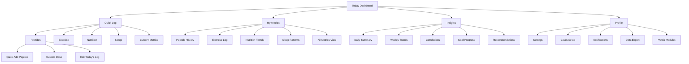

# Peptide Tracker UI/UX Specification

## Introduction

This document defines the user experience goals, information architecture, user flows, and visual design specifications for Peptide Tracker's user interface. It serves as the foundation for visual design and frontend development, ensuring a cohesive and user-centered experience.

## Overall UX Goals & Principles

### Target User Personas

**Health-Conscious Individual:** Adults (18-70) who are proactive about tracking their wellness metrics, including peptide supplementation. They want simple logging with meaningful insights and progress tracking over time.

**Wellness Beginner:** Newer to health tracking who needs guidance, clear explanations, and encouraging feedback. They value simplicity and educational content to build healthy habits.

**Quantified Self Enthusiast:** Data-driven individuals who want comprehensive tracking, detailed analytics, and the ability to correlate different health metrics (peptides, sleep, exercise, etc.). They prioritize flexibility and deep insights.

### Usability Goals

**Ease of daily logging:** Users can log their peptide intake and other health metrics in under 30 seconds per entry.

**Habit formation:** Interface design encourages consistent daily use through positive reinforcement, streaks, and gentle reminders.

**Meaningful insights:** Users can easily understand their trends and patterns without needing to interpret complex data.

**Flexible tracking:** Users can customize which metrics they track based on their personal health goals and interests.

### Design Principles

**1. Effortless Daily Use** - Prioritize quick, frictionless logging that fits seamlessly into daily routines.

**2. Encouraging Progress** - Celebrate achievements and progress to motivate continued engagement and healthy habits.

**3. Personal Relevance** - Allow customization so each user sees only the metrics that matter to their health journey.

**4. Clear Understanding** - Present health data in intuitive, actionable ways that empower users to make informed decisions.

**5. Trust and Privacy** - Design with obvious respect for personal health data privacy and security.

### Key User Journey Insights

**The Morning Routine User:**
- Needs ultra-fast logging during busy morning routine
- Wants quick progress check and motivation boost
- Pain points: slow app loading, unclear logging status

**The Evening Reflector:**
- Prefers batch logging all daily metrics in one session
- Values trend analysis and metric correlations
- Pain points: difficulty remembering exact timing, need for batch entry modes

**The Inconsistent Tracker:**
- Struggles with consistency, feels guilt from broken streaks
- Needs gentle re-engagement and simplified views
- Critical need: forgiving design that doesn't punish missed days

## Information Architecture (IA)

### Site Map / Screen Inventory

### Navigation Structure

**Primary Navigation:** Bottom tab navigation optimized for mobile-first use - "Today" (dashboard), "Quick Log" (fast entry), "Insights" (trends/analysis), and "Profile" (settings/customization). This supports both morning quick-loggers and evening reviewers.

**Secondary Navigation:** Context-sensitive within each section. Quick Log has swipeable metric cards, Insights has time period filters (day/week/month), and Profile contains module toggles for the modular tracking system.

**Breadcrumb Strategy:** Minimal breadcrumbs since most actions are 1-2 levels deep. Focus on clear "back" navigation and contextual headers showing current metric or time period being viewed.

## Next Steps

### Immediate Actions
1. Review this specification with stakeholders for validation
2. Create detailed wireframes and mockups in design tool
3. Hand off to architect for frontend architecture specification
4. Define specific component requirements and technical constraints

### Design Handoff Checklist
- [x] User personas and goals documented
- [x] Information architecture defined
- [x] User journey insights captured
- [x] Navigation strategy established
- [ ] User flows documented (to be completed)
- [ ] Component inventory complete (to be completed)
- [ ] Accessibility requirements defined (to be completed)
- [ ] Responsive strategy clear (to be completed)
- [ ] Brand guidelines incorporated (to be completed)
- [ ] Performance goals established (to be completed)

---

*This specification focuses on the core foundation for a consumer health tracking app with modular metric tracking capabilities. Additional sections (user flows, wireframes, component library, branding, accessibility, responsiveness, and animation) should be completed as the design process continues.*