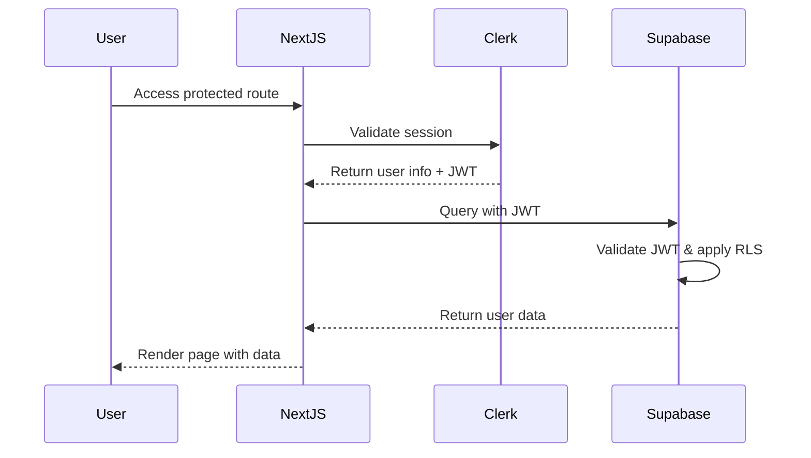
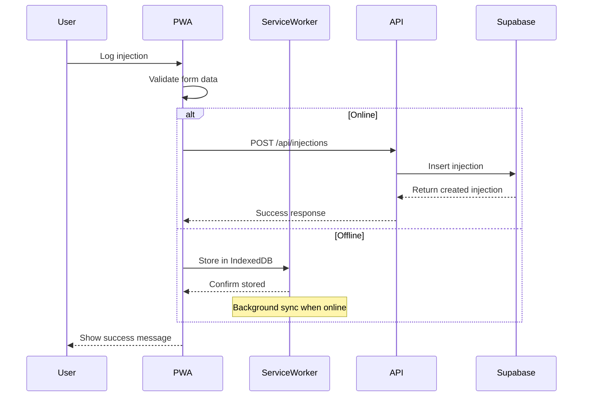
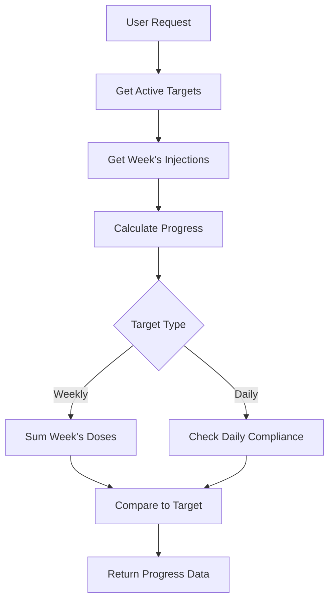

# Peptide Tracker Technical Architecture

## Table of Contents

1. [System Architecture Overview](#system-architecture-overview)
2. [Database Schema Design](#database-schema-design)
3. [API Design](#api-design)
4. [Data Flow Architecture](#data-flow-architecture)
5. [Security Architecture](#security-architecture)
6. [Component Architecture](#component-architecture)
7. [Deployment Architecture](#deployment-architecture)
8. [Testing Strategy](#testing-strategy)
9. [Performance Considerations](#performance-considerations)
10. [Implementation Timeline](#implementation-timeline)

## System Architecture Overview

### High-Level Architecture

The Peptide Tracker follows a modern JAMstack architecture with the following technology stack:

```
┌─────────────────────────────────────────────────────────────┐
│                     Vercel Edge Network                     │
│                  (Global CDN + Edge Functions)              │
└─────────────────────────────────────────────────────────────┘
                              │
┌─────────────────────────────────────────────────────────────┐
│                   Next.js 14+ Application                   │
│  ┌─────────────────┐  ┌─────────────────┐  ┌─────────────── │
│  │   React Frontend │  │  API Routes     │  │  PWA Service  │
│  │   (React 18+)    │  │  (Server-side)  │  │  Workers      │
│  └─────────────────┘  └─────────────────┘  └─────────────── │
└─────────────────────────────────────────────────────────────┘
                              │
        ┌─────────────────────┼─────────────────────┐
        │                     │                     │
┌───────▼─────────┐  ┌────────▼──────────┐  ┌─────▼─────┐
│   Clerk.com     │  │    Supabase       │  │  Vercel   │
│   Auth & Billing│  │   PostgreSQL      │  │  Analytics│
│                 │  │   + Edge Functions│  │           │
└─────────────────┘  └───────────────────┘  └───────────┘
```

### Core Technology Decisions

**Frontend Framework**: Next.js 14+ with App Router
- Server-side rendering for optimal performance
- Built-in API routes for backend functionality
- Automatic code splitting and optimization
- Native PWA support through next-pwa

**Authentication & Billing**: Clerk.com
- Complete user management solution
- Built-in billing integration (beta features)
- Social login support
- Session management with JWT tokens

**Database**: Supabase (PostgreSQL)
- Managed PostgreSQL with real-time subscriptions
- Row Level Security (RLS) for data isolation
- Built-in API generation
- Edge functions for complex operations

**Hosting**: Vercel
- Seamless Next.js integration
- Global edge deployment
- Automatic preview deployments
- Environment management

## Database Schema Design

### Core Tables

```sql
-- Users table managed by Clerk, referenced by clerk_user_id

-- Peptides table (both pre-configured and custom)
CREATE TABLE peptides (
    id UUID PRIMARY KEY DEFAULT gen_random_uuid(),
    name VARCHAR(255) NOT NULL,
    description TEXT,
    typical_dose_min DECIMAL(10,3),
    typical_dose_max DECIMAL(10,3),
    dose_unit VARCHAR(20) DEFAULT 'mg',
    category VARCHAR(100),
    safety_notes TEXT,
    is_system_peptide BOOLEAN DEFAULT false,
    created_by VARCHAR(255), -- clerk_user_id for custom peptides
    created_at TIMESTAMP WITH TIME ZONE DEFAULT NOW(),
    updated_at TIMESTAMP WITH TIME ZONE DEFAULT NOW()
);

-- User's personal peptide library
CREATE TABLE user_peptides (
    id UUID PRIMARY KEY DEFAULT gen_random_uuid(),
    clerk_user_id VARCHAR(255) NOT NULL,
    peptide_id UUID REFERENCES peptides(id),
    is_active BOOLEAN DEFAULT true,
    personal_notes TEXT,
    custom_dose_min DECIMAL(10,3),
    custom_dose_max DECIMAL(10,3),
    created_at TIMESTAMP WITH TIME ZONE DEFAULT NOW(),
    updated_at TIMESTAMP WITH TIME ZONE DEFAULT NOW(),
    UNIQUE(clerk_user_id, peptide_id)
);

-- Dose targets/protocols
CREATE TABLE dose_targets (
    id UUID PRIMARY KEY DEFAULT gen_random_uuid(),
    clerk_user_id VARCHAR(255) NOT NULL,
    user_peptide_id UUID REFERENCES user_peptides(id),
    target_type VARCHAR(20) CHECK (target_type IN ('weekly', 'daily')),
    target_dose DECIMAL(10,3) NOT NULL,
    dose_unit VARCHAR(20) DEFAULT 'mg',
    schedule_pattern JSONB, -- {"days": [1,3,5], "times": ["09:00"]}
    start_date DATE,
    end_date DATE,
    is_active BOOLEAN DEFAULT true,
    created_at TIMESTAMP WITH TIME ZONE DEFAULT NOW(),
    updated_at TIMESTAMP WITH TIME ZONE DEFAULT NOW()
);

-- Injection sites reference
CREATE TABLE injection_sites (
    id UUID PRIMARY KEY DEFAULT gen_random_uuid(),
    name VARCHAR(100) NOT NULL,
    category VARCHAR(50), -- 'subcutaneous', 'intramuscular'
    body_region VARCHAR(50),
    description TEXT,
    display_order INTEGER DEFAULT 0
);

-- Core injections table
CREATE TABLE injections (
    id UUID PRIMARY KEY DEFAULT gen_random_uuid(),
    clerk_user_id VARCHAR(255) NOT NULL,
    user_peptide_id UUID REFERENCES user_peptides(id),
    dose_amount DECIMAL(10,3) NOT NULL,
    dose_unit VARCHAR(20) DEFAULT 'mg',
    injection_site_id UUID REFERENCES injection_sites(id),
    injection_date DATE NOT NULL,
    injection_time TIME NOT NULL,
    notes TEXT,
    created_at TIMESTAMP WITH TIME ZONE DEFAULT NOW(),
    updated_at TIMESTAMP WITH TIME ZONE DEFAULT NOW(),
    -- Audit fields
    created_offline BOOLEAN DEFAULT false,
    synced_at TIMESTAMP WITH TIME ZONE
);

-- Expert content from Jay Campbell
CREATE TABLE expert_content (
    id UUID PRIMARY KEY DEFAULT gen_random_uuid(),
    title VARCHAR(255) NOT NULL,
    content_type VARCHAR(50), -- 'protocol', 'safety', 'education'
    content TEXT NOT NULL,
    peptide_ids UUID[], -- Associated peptides
    category VARCHAR(100),
    author VARCHAR(100) DEFAULT 'Jay Campbell',
    published_at TIMESTAMP WITH TIME ZONE DEFAULT NOW(),
    is_featured BOOLEAN DEFAULT false,
    display_order INTEGER DEFAULT 0
);

-- User preferences and settings
CREATE TABLE user_preferences (
    clerk_user_id VARCHAR(255) PRIMARY KEY,
    timezone VARCHAR(100) DEFAULT 'UTC',
    dose_unit_preference VARCHAR(20) DEFAULT 'mg',
    date_format VARCHAR(20) DEFAULT 'MM/DD/YYYY',
    notification_settings JSONB DEFAULT '{}',
    export_preferences JSONB DEFAULT '{}',
    created_at TIMESTAMP WITH TIME ZONE DEFAULT NOW(),
    updated_at TIMESTAMP WITH TIME ZONE DEFAULT NOW()
);
```

### Indexing Strategy

```sql
-- Performance indexes for common queries
CREATE INDEX idx_injections_user_date ON injections(clerk_user_id, injection_date DESC);
CREATE INDEX idx_injections_user_peptide ON injections(clerk_user_id, user_peptide_id);
CREATE INDEX idx_injections_date_range ON injections(injection_date) WHERE injection_date >= CURRENT_DATE - INTERVAL '30 days';
CREATE INDEX idx_user_peptides_active ON user_peptides(clerk_user_id) WHERE is_active = true;
CREATE INDEX idx_dose_targets_active ON dose_targets(clerk_user_id) WHERE is_active = true;
CREATE INDEX idx_peptides_system ON peptides(category) WHERE is_system_peptide = true;

-- Text search indexes
CREATE INDEX idx_peptides_name_search ON peptides USING gin(to_tsvector('english', name || ' ' || COALESCE(description, '')));
CREATE INDEX idx_injections_notes_search ON injections USING gin(to_tsvector('english', COALESCE(notes, '')));
```

### Row Level Security (RLS)

```sql
-- Enable RLS on all user tables
ALTER TABLE user_peptides ENABLE ROW LEVEL SECURITY;
ALTER TABLE dose_targets ENABLE ROW LEVEL SECURITY;
ALTER TABLE injections ENABLE ROW LEVEL SECURITY;
ALTER TABLE user_preferences ENABLE ROW LEVEL SECURITY;

-- RLS policies for complete data isolation
CREATE POLICY "Users can only access their own peptides" ON user_peptides
    FOR ALL USING (clerk_user_id = auth.jwt() ->> 'sub');

CREATE POLICY "Users can only access their own dose targets" ON dose_targets
    FOR ALL USING (clerk_user_id = auth.jwt() ->> 'sub');

CREATE POLICY "Users can only access their own injections" ON injections
    FOR ALL USING (clerk_user_id = auth.jwt() ->> 'sub');

CREATE POLICY "Users can only access their own preferences" ON user_preferences
    FOR ALL USING (clerk_user_id = auth.jwt() ->> 'sub');
```

## API Design

### RESTful API Structure

The API follows RESTful conventions with clear resource organization:

```typescript
// Base API structure
/api/
├── auth/
│   ├── webhook          // Clerk webhook for user events
│   └── session         // Session validation
├── peptides/
│   ├── system          // GET - System peptides library
│   ├── user            // GET, POST - User's peptide library
│   └── [id]            // GET, PUT, DELETE - Specific peptide
├── injections/
│   ├── index           // GET, POST - List/create injections
│   ├── [id]            // GET, PUT, DELETE - Specific injection
│   ├── summary         // GET - Last 7 days summary
│   └── export          // POST - Export data
├── targets/
│   ├── index           // GET, POST - Dose targets
│   ├── [id]            // GET, PUT, DELETE - Specific target
│   └── progress        // GET - Weekly progress
├── content/
│   ├── protocols       // GET - Jay Campbell protocols
│   ├── education       // GET - Educational content
│   └── safety          // GET - Safety guidelines
└── user/
    ├── preferences     // GET, PUT - User preferences
    └── analytics       // GET - User analytics
```

### API Route Examples

```typescript
// /api/injections/index.ts
export async function GET(request: Request) {
  const { searchParams } = new URL(request.url);
  const page = parseInt(searchParams.get('page') || '1');
  const limit = parseInt(searchParams.get('limit') || '20');
  const startDate = searchParams.get('startDate');
  const endDate = searchParams.get('endDate');
  const peptideId = searchParams.get('peptideId');

  const { userId } = auth();
  if (!userId) return new Response('Unauthorized', { status: 401 });

  const filters = buildFilters({ startDate, endDate, peptideId });
  const injections = await getInjectionsWithFilters(userId, filters, page, limit);

  return Response.json(injections);
}

export async function POST(request: Request) {
  const { userId } = auth();
  if (!userId) return new Response('Unauthorized', { status: 401 });

  const body = await request.json();
  const validatedData = injectionSchema.parse(body);

  const injection = await createInjection(userId, validatedData);
  return Response.json(injection, { status: 201 });
}
```

### Data Validation Schema

```typescript
// lib/schemas.ts
import { z } from 'zod';

export const injectionSchema = z.object({
  userPeptideId: z.string().uuid(),
  doseAmount: z.number().positive().max(1000),
  doseUnit: z.string().default('mg'),
  injectionSiteId: z.string().uuid(),
  injectionDate: z.string().regex(/^\d{4}-\d{2}-\d{2}$/),
  injectionTime: z.string().regex(/^\d{2}:\d{2}$/),
  notes: z.string().optional(),
});

export const doseTargetSchema = z.object({
  userPeptideId: z.string().uuid(),
  targetType: z.enum(['weekly', 'daily']),
  targetDose: z.number().positive(),
  doseUnit: z.string().default('mg'),
  schedulePattern: z.object({
    days: z.array(z.number().min(1).max(7)).optional(),
    times: z.array(z.string().regex(/^\d{2}:\d{2}$/)).optional(),
  }).optional(),
  startDate: z.string().regex(/^\d{4}-\d{2}-\d{2}$/),
  endDate: z.string().regex(/^\d{4}-\d{2}-\d{2}$/).optional(),
});
```

## Data Flow Architecture

### Authentication Flow



### Injection Logging Flow



### Weekly Progress Calculation



## Security Architecture

### Authentication & Authorization

**Clerk Integration**:
- JWT tokens for stateless authentication
- Automatic session management
- Social login providers
- Multi-factor authentication support

**API Security**:
```typescript
// middleware.ts
import { authMiddleware } from "@clerk/nextjs";

export default authMiddleware({
  publicRoutes: ["/", "/about", "/api/webhook"],
  ignoredRoutes: ["/api/health"],
});

export const config = {
  matcher: ["/((?!.*\\..*|_next).*)", "/", "/(api|trpc)(.*)"],
};
```

### Data Protection

**Row Level Security (RLS)**:
- Complete data isolation per user
- Automatic filtering based on JWT claims
- No cross-user data access possible

**Data Encryption**:
- HTTPS enforced for all connections
- Database encryption at rest (Supabase)
- Sensitive data hashed/encrypted in application layer

**Input Validation**:
```typescript
// lib/validation.ts
export function validateInjectionInput(data: unknown) {
  const result = injectionSchema.safeParse(data);
  if (!result.success) {
    throw new ValidationError(result.error.issues);
  }
  return result.data;
}

export function sanitizeUserInput(input: string): string {
  return DOMPurify.sanitize(input, { ALLOWED_TAGS: [] });
}
```

### HIPAA-Adjacent Compliance

**Data Handling**:
- Minimal data collection
- Explicit user consent for data processing
- Clear data retention policies
- User-initiated data deletion

**Access Controls**:
- Role-based access (future admin features)
- Audit logging for sensitive operations
- Session timeout and management
- Secure password requirements

## Component Architecture

### Frontend Structure

```
src/
├── app/                    # Next.js App Router
│   ├── (dashboard)/       # Authenticated routes
│   │   ├── dashboard/     # Main dashboard
│   │   ├── injections/    # Injection management
│   │   ├── peptides/      # Peptide library
│   │   ├── progress/      # Progress tracking
│   │   └── settings/      # User settings
│   ├── (auth)/           # Authentication routes
│   ├── api/              # API routes
│   └── globals.css       # Global styles
├── components/           # Reusable components
│   ├── ui/              # Base UI components
│   ├── forms/           # Form components
│   ├── charts/          # Data visualization
│   └── layout/          # Layout components
├── lib/                 # Utility libraries
│   ├── db/             # Database utilities
│   ├── auth/           # Authentication helpers
│   ├── validation/     # Input validation
│   └── utils/          # General utilities
└── types/              # TypeScript definitions
```

### Component Design System

**Base Components** (following design tokens):
```typescript
// components/ui/Button.tsx
interface ButtonProps {
  variant: 'primary' | 'secondary' | 'danger';
  size: 'sm' | 'md' | 'lg';
  children: React.ReactNode;
}

export function Button({ variant, size, children, ...props }: ButtonProps) {
  const baseClasses = "font-antonio font-bold transition-colors";
  const variantClasses = {
    primary: "bg-red-500 hover:bg-red-600 text-white",
    secondary: "bg-gray-700 hover:bg-gray-600 text-white",
    danger: "bg-red-600 hover:bg-red-700 text-white"
  };

  return (
    <button
      className={cn(baseClasses, variantClasses[variant], sizeClasses[size])}
      {...props}
    >
      {children}
    </button>
  );
}
```

**Form Components**:
```typescript
// components/forms/InjectionForm.tsx
export function InjectionForm({ onSubmit, initialData }: InjectionFormProps) {
  const form = useForm({
    resolver: zodResolver(injectionSchema),
    defaultValues: initialData,
  });

  return (
    <Form {...form}>
      <FormField name="peptideId" component={PeptideSelect} />
      <FormField name="doseAmount" component={NumberInput} />
      <FormField name="injectionSite" component={InjectionSiteSelect} />
      <FormField name="notes" component={TextArea} />
      <Button type="submit">Log Injection</Button>
    </Form>
  );
}
```

### State Management

**React Context for Global State**:
```typescript
// contexts/AppContext.tsx
interface AppContextType {
  user: User | null;
  peptides: UserPeptide[];
  recentInjections: Injection[];
  refreshData: () => Promise<void>;
}

export const AppContext = createContext<AppContextType | null>(null);

export function AppProvider({ children }: { children: React.ReactNode }) {
  const [user, setUser] = useState<User | null>(null);
  const [peptides, setPeptides] = useState<UserPeptide[]>([]);

  // Context implementation
  return (
    <AppContext.Provider value={{ user, peptides, refreshData }}>
      {children}
    </AppContext.Provider>
  );
}
```

**Local State with React Hook Form**:
```typescript
// hooks/useInjectionForm.ts
export function useInjectionForm(initialData?: Partial<Injection>) {
  const form = useForm<InjectionFormData>({
    resolver: zodResolver(injectionSchema),
    defaultValues: {
      doseAmount: '',
      injectionDate: format(new Date(), 'yyyy-MM-dd'),
      injectionTime: format(new Date(), 'HH:mm'),
      ...initialData,
    },
  });

  const { mutate: createInjection, isLoading } = useMutation({
    mutationFn: (data: InjectionFormData) =>
      fetch('/api/injections', {
        method: 'POST',
        headers: { 'Content-Type': 'application/json' },
        body: JSON.stringify(data),
      }).then(res => res.json()),
    onSuccess: () => {
      toast.success('Injection logged successfully');
      form.reset();
    },
  });

  return { form, createInjection, isLoading };
}
```

## Deployment Architecture

### Vercel Configuration

```yaml
# vercel.json
{
  "framework": "nextjs",
  "buildCommand": "npm run build",
  "devCommand": "npm run dev",
  "installCommand": "npm ci",
  "functions": {
    "app/api/**/*.ts": {
      "maxDuration": 30
    }
  },
  "env": {
    "NODE_ENV": "production"
  }
}
```

### Environment Configuration

```bash
# .env.local (development)
NEXT_PUBLIC_CLERK_PUBLISHABLE_KEY=pk_test_...
CLERK_SECRET_KEY=sk_test_...
NEXT_PUBLIC_CLERK_SIGN_IN_URL=/sign-in
NEXT_PUBLIC_CLERK_SIGN_UP_URL=/sign-up

NEXT_PUBLIC_SUPABASE_URL=https://xxx.supabase.co
NEXT_PUBLIC_SUPABASE_ANON_KEY=eyJ...
SUPABASE_SERVICE_ROLE_KEY=eyJ...

NEXT_PUBLIC_APP_URL=http://localhost:3000
```

### PWA Configuration

```javascript
// next.config.js
const withPWA = require('next-pwa')({
  dest: 'public',
  register: true,
  skipWaiting: true,
  disable: process.env.NODE_ENV === 'development',
});

module.exports = withPWA({
  experimental: {
    appDir: true,
  },
  images: {
    domains: ['images.clerk.dev'],
  },
});
```

```json
// public/manifest.json
{
  "name": "Peptide Tracker",
  "short_name": "PeptideTracker",
  "description": "Professional peptide injection tracking",
  "start_url": "/dashboard",
  "display": "standalone",
  "background_color": "#1a1a1a",
  "theme_color": "#ff3427",
  "icons": [
    {
      "src": "/icons/icon-192x192.png",
      "sizes": "192x192",
      "type": "image/png"
    },
    {
      "src": "/icons/icon-512x512.png",
      "sizes": "512x512",
      "type": "image/png"
    }
  ]
}
```

### Service Worker Implementation

```typescript
// public/sw.js
const CACHE_NAME = 'peptide-tracker-v1';
const urlsToCache = [
  '/',
  '/dashboard',
  '/injections',
  '/offline',
];

self.addEventListener('install', (event) => {
  event.waitUntil(
    caches.open(CACHE_NAME)
      .then((cache) => cache.addAll(urlsToCache))
  );
});

self.addEventListener('fetch', (event) => {
  // Offline injection logging strategy
  if (event.request.url.includes('/api/injections') && event.request.method === 'POST') {
    event.respondWith(
      fetch(event.request).catch(() => {
        // Store in IndexedDB for later sync
        return storeOfflineInjection(event.request);
      })
    );
  }
});

// Background sync for offline injections
self.addEventListener('sync', (event) => {
  if (event.tag === 'injection-sync') {
    event.waitUntil(syncOfflineInjections());
  }
});
```

## Testing Strategy

### Unit Testing

```typescript
// __tests__/components/InjectionForm.test.tsx
import { render, screen, fireEvent, waitFor } from '@testing-library/react';
import { InjectionForm } from '@/components/forms/InjectionForm';

describe('InjectionForm', () => {
  it('validates required fields', async () => {
    render(<InjectionForm onSubmit={jest.fn()} />);

    fireEvent.click(screen.getByText('Log Injection'));

    await waitFor(() => {
      expect(screen.getByText('Peptide is required')).toBeInTheDocument();
      expect(screen.getByText('Dose amount is required')).toBeInTheDocument();
    });
  });

  it('prevents future-dated injections', async () => {
    render(<InjectionForm onSubmit={jest.fn()} />);

    const dateInput = screen.getByLabelText('Injection Date');
    fireEvent.change(dateInput, {
      target: { value: '2025-12-31' }
    });

    await waitFor(() => {
      expect(screen.getByText('Cannot log future injections')).toBeInTheDocument();
    });
  });
});
```

### Integration Testing

```typescript
// __tests__/api/injections.test.ts
import { createMocks } from 'node-mocks-http';
import handler from '@/app/api/injections/route';

describe('/api/injections', () => {
  it('creates injection with valid data', async () => {
    const { req, res } = createMocks({
      method: 'POST',
      body: {
        userPeptideId: 'valid-uuid',
        doseAmount: 2.5,
        injectionSiteId: 'valid-site-id',
        injectionDate: '2024-01-15',
        injectionTime: '09:00',
      },
    });

    await handler(req, res);

    expect(res._getStatusCode()).toBe(201);
    const data = JSON.parse(res._getData());
    expect(data.id).toBeDefined();
    expect(data.doseAmount).toBe(2.5);
  });

  it('rejects invalid dose amounts', async () => {
    const { req, res } = createMocks({
      method: 'POST',
      body: {
        doseAmount: -1, // Invalid negative dose
      },
    });

    await handler(req, res);

    expect(res._getStatusCode()).toBe(400);
  });
});
```

### E2E Testing Strategy

```typescript
// playwright.config.ts
import { defineConfig } from '@playwright/test';

export default defineConfig({
  testDir: './e2e',
  fullyParallel: true,
  projects: [
    {
      name: 'chromium',
      use: { ...devices['Desktop Chrome'] },
    },
    {
      name: 'webkit',
      use: { ...devices['Desktop Safari'] },
    },
    {
      name: 'Mobile Chrome',
      use: { ...devices['Pixel 5'] },
    },
  ],
});

// e2e/injection-flow.spec.ts
test('complete injection logging flow', async ({ page }) => {
  await page.goto('/dashboard');

  // Log new injection
  await page.click('text=Log Injection');
  await page.selectOption('[data-testid=peptide-select]', 'semaglutide');
  await page.fill('[data-testid=dose-input]', '2.5');
  await page.selectOption('[data-testid=site-select]', 'abdomen-left');
  await page.click('text=Save Injection');

  // Verify in history
  await page.click('text=View History');
  await expect(page.locator('text=2.5 mg')).toBeVisible();
  await expect(page.locator('text=Semaglutide')).toBeVisible();
});
```

## Performance Considerations

### Database Optimization

**Query Optimization**:
```sql
-- Optimized injection history query with pagination
SELECT
    i.id,
    i.dose_amount,
    i.injection_date,
    i.injection_time,
    p.name as peptide_name,
    s.name as site_name,
    i.notes
FROM injections i
JOIN user_peptides up ON i.user_peptide_id = up.id
JOIN peptides p ON up.peptide_id = p.id
JOIN injection_sites s ON i.injection_site_id = s.id
WHERE i.clerk_user_id = $1
    AND ($2 IS NULL OR i.injection_date >= $2)
    AND ($3 IS NULL OR i.injection_date <= $3)
    AND ($4 IS NULL OR up.peptide_id = $4)
ORDER BY i.injection_date DESC, i.injection_time DESC
LIMIT $5 OFFSET $6;
```

**Caching Strategy**:
```typescript
// lib/cache.ts
import { unstable_cache } from 'next/cache';

export const getCachedSystemPeptides = unstable_cache(
  async () => {
    return await getSystemPeptides();
  },
  ['system-peptides'],
  { revalidate: 3600 } // 1 hour cache
);

export const getCachedUserSummary = unstable_cache(
  async (userId: string) => {
    return await getUserWeeklySummary(userId);
  },
  ['user-summary'],
  { revalidate: 300, tags: [`user-${userId}`] } // 5 min cache
);
```

### Frontend Optimization

**Code Splitting**:
```typescript
// app/dashboard/progress/page.tsx
import dynamic from 'next/dynamic';

const ProgressCharts = dynamic(() => import('@/components/charts/ProgressCharts'), {
  ssr: false,
  loading: () => <ChartSkeleton />,
});

export default function ProgressPage() {
  return (
    <div>
      <h1>Weekly Progress</h1>
      <ProgressCharts />
    </div>
  );
}
```

**Image Optimization**:
```typescript
// components/ui/InjectionSiteImage.tsx
import Image from 'next/image';

export function InjectionSiteImage({ site }: { site: InjectionSite }) {
  return (
    <Image
      src={`/images/injection-sites/${site.id}.webp`}
      alt={site.name}
      width={200}
      height={200}
      priority={false}
      placeholder="blur"
      blurDataURL="data:image/jpeg;base64,..."
    />
  );
}
```

### Offline Performance

**IndexedDB for Offline Storage**:
```typescript
// lib/offline.ts
class OfflineStorage {
  private db: IDBDatabase | null = null;

  async init() {
    return new Promise<void>((resolve, reject) => {
      const request = indexedDB.open('PeptideTracker', 1);

      request.onerror = () => reject(request.error);
      request.onsuccess = () => {
        this.db = request.result;
        resolve();
      };

      request.onupgradeneeded = () => {
        const db = request.result;
        const store = db.createObjectStore('offlineInjections', {
          keyPath: 'id',
          autoIncrement: true,
        });
        store.createIndex('timestamp', 'timestamp');
      };
    });
  }

  async storeInjection(injection: OfflineInjection) {
    const transaction = this.db!.transaction(['offlineInjections'], 'readwrite');
    const store = transaction.objectStore('offlineInjections');
    return store.add({
      ...injection,
      timestamp: Date.now(),
      synced: false,
    });
  }

  async getPendingInjections(): Promise<OfflineInjection[]> {
    const transaction = this.db!.transaction(['offlineInjections'], 'readonly');
    const store = transaction.objectStore('offlineInjections');
    const request = store.getAll();

    return new Promise((resolve, reject) => {
      request.onsuccess = () => resolve(request.result.filter(i => !i.synced));
      request.onerror = () => reject(request.error);
    });
  }
}
```

## Implementation Timeline

### Phase 1: Foundation (Weeks 1-4)

**Week 1-2: Project Setup**
- Next.js project initialization
- Clerk authentication integration
- Supabase database setup
- Basic routing and layout

**Week 3-4: Core Database & API**
- Database schema implementation
- Core API routes
- Authentication middleware
- Basic peptide management

### Phase 2: Core Features (Weeks 5-10)

**Week 5-6: Injection Logging**
- Injection form components
- Validation and error handling
- Basic injection history

**Week 7-8: Advanced History & Filtering**
- Advanced filtering capabilities
- Pagination and search
- Mobile-responsive design

**Week 9-10: Progress Tracking**
- Dose targets implementation
- Weekly progress calculations
- Progress visualization

### Phase 3: Enhancement (Weeks 11-16)

**Week 11-12: PWA & Offline**
- Service worker implementation
- Offline injection logging
- Background sync

**Week 13-14: Expert Content**
- Jay Campbell content integration
- Safety features
- Educational materials

**Week 15-16: Export & Analytics**
- Data export functionality
- User analytics
- Performance optimization

### Phase 4: Polish & Launch (Weeks 17-20)

**Week 17-18: Testing & QA**
- Comprehensive testing
- Performance optimization
- Security review

**Week 19-20: Launch Preparation**
- Production deployment
- Monitoring setup
- Documentation completion

This technical architecture provides a solid foundation for building the Peptide Tracker application that meets all requirements from the PRD. The modular design allows for iterative development while maintaining scalability for future AI-powered features.